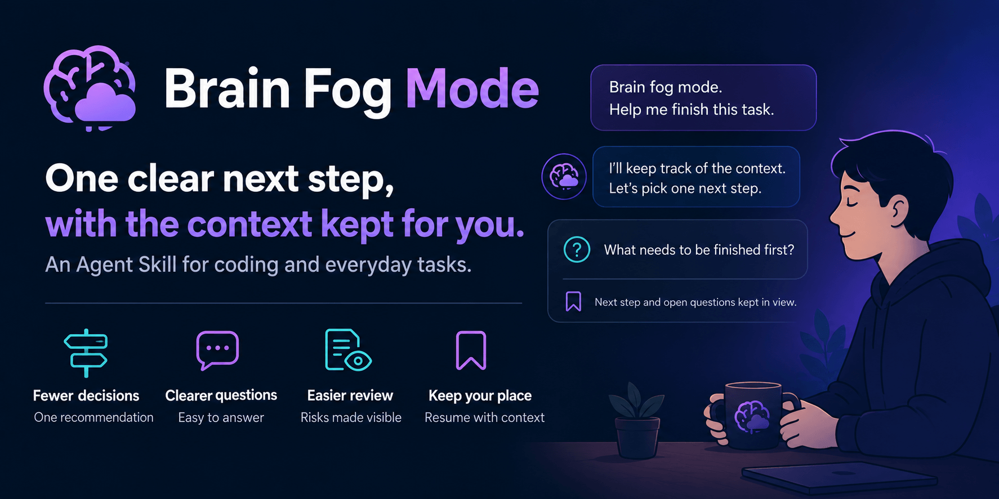

# Brain Fog Mode

[](LICENSE)
[](skills/brain-fog-mode/SKILL.md)
[](skills/brain-fog-mode/)
[](#reviewers-and-feedback)



**One clear next step, with the context kept for you.**

An Agent Skill that helps your AI assistant simplify decisions, surface risks, and keep track of unfinished work. For coding and everyday tasks.

I started building it when I was overloaded. You don’t need brain fog to use it. 😅

**Beta.** An accessibility and work-continuity aid; no diagnosis or treatment claims.

## Try It

```bash
npx skills add beholdrlabs/brain-fog-mode
```

Choose `brain-fog-mode`, then tell your assistant:

> Brain fog mode. Help me with [your task].

Say **“normal mode”** to turn it off. From a local checkout, install with `npx skills add .`.

## What Changes

- **Fewer decisions:** one recommendation, the fact that could change it, and “not sure” as a valid answer.
- **Clearer questions:** likely goals to choose from when the task is unclear; one blocking question at a time.
- **Easier review:** the result first, every high-risk issue, and what remains unverified.
- **Keep your place:** task context stays visible; a restart note tells you where to resume and where it is saved.

The agent handles small, reversible choices within scope and asks before consequential actions.

## Without And With The Skill

**Same task, two fresh-context agents.** The control loaded no skills; the other agent loaded this skill with Brain Fog Mode active. These are recorded responses from a small experiment.

| Without Brain Fog Mode | With Brain Fog Mode |
| ---: | ---: |
| 233 words | 103 words |

Counts describe the recorded response lengths.

<details>
<summary>Click to see details</summary>

**Prompt:**

Help me study systems engineering, AWS platform focused. I don't know where to begin.

### Without Brain Fog Mode

Start with **how a small system works**, then learn the AWS services that provide each part. That will give you a stronger foundation than memorizing service names.

I’d use this four-week starting plan, with roughly 30–45 minutes a day:

| Week | Learn | Practice |
|---|---|---|
| 1 | Linux basics, processes, files, HTTP, DNS, and networking | Follow what happens when a browser requests a page |
| 2 | AWS regions, availability zones, IAM, compute, and storage | Draw a system using EC2, S3, and a database; explain each component |
| 3 | VPCs, security groups, monitoring, and permissions | Deploy a small app in a learning environment and inspect its logs |
| 4 | Reliability, backups, automation, and cost | Describe how your app handles failure, restores data, and gets updated |

For AWS fundamentals, use the official [Cloud Essentials learning path](https://aws.amazon.com/training/learn-about/cloud-practitioner/), which covers core services, security, and pricing. Once you have a small working system, use the [AWS Well-Architected Framework](https://docs.aws.amazon.com/wellarchitected/latest/framework/welcome.html) to assess its reliability, security, and operating choices.

For any personal AWS labs, check pricing, set a budget alert, and remove resources when finished. Budget alerts are notifications, not a spending cap.

**Today:** Spend 30 minutes on the first Cloud Essentials lesson. Write down what a server does, what a network does, and what storage does. These are the building blocks you’ll keep returning to.

Have you used Linux or written any code before, and are you studying for a job, a certification, or a project?

---

### With Brain Fog Mode

**Begin with one small lesson: how a web request moves through an AWS system.** I'll assume you're starting with the basics; say `more advanced` if that is too easy.

Use this simplified path:

**Visitor → load balancer → web server → database**

The load balancer distributes requests; the web server runs the application; the database stores its data. AWS's [web-and-database example, Overview and Security sections](https://docs.aws.amazon.com/en_en/vpc/latest/userguide/vpc-example-web-database-servers.html) shows that flow and how access between the parts is restricted.

**Next:** On paper, draw those four boxes and add one sentence describing each box's job. Keep this first exercise on paper, so it needs no AWS account or paid resources.

The control gives a four-week plan. With the mode active, the agent chooses one starting lesson and one next action.

</details>

[Browse more examples](docs/examples.md), including shop sales, a cookie recipe, agent token usage, and keeping your place in work.

## When It Applies

| Request | Scope |
| --- | --- |
| “Brain fog mode,” “low-bandwidth mode,” or an explicit overload or interruption signal | Session mode, until disabled |
| “Help me decide…” | That decision, including clarification replies; stops when answered or the task changes |
| “This report is too much. Simplify it.” | One answer |

Ordinary brevity, comparison, or summary requests do not activate it by themselves. [Full activation details](skills/brain-fog-mode/README.md#activation-examples).

## Beta Status

**30 behavioral cases · 38 activation cases · 10 safety probes.** [Browse the evals](skills/brain-fog-mode/evals/).

Manual evaluations check instruction following. Benefits to users remain unproven; automation, security checks, and human safety review are still open.

[Changelog](CHANGELOG.md) · [Audit status](docs/security-audit.md) · [Evidence](docs/source-faithfulness.md) · [Direction and roadmap](docs/direction.md)

## Reviewers And Feedback

Try one real task. Tell us **what helped, what added effort, and which assistant/model you used**.

Use the **Feedback** Discussion form when available. Keep health details and private work out of public posts. For private feedback or informal expert review, use the [reviewer questionnaire](docs/reviewer-questionnaire.md) and arrange a private return with the maintainer.

## Safety

No health information is stored by default. For severe, worsening, or unsafe symptoms, the assistant should suggest qualified professional or local emergency help rather than encourage pushing through.

## License

[MIT](LICENSE).
